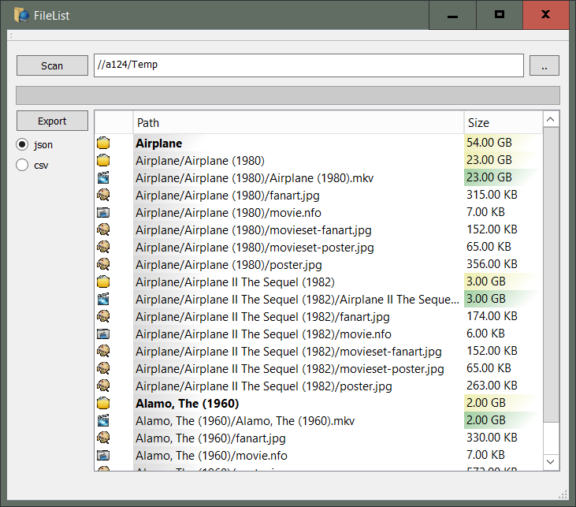

# QT-File-List

Scan directories for media files and export a list of files found  

features  
========
* Scans directories and their sub directories for media files
* List media by type  
* List size by colors  
* Export to json  
* Export to csv  
* Can be used to list non media files too  

screenshot
========


export format  
========
* json  
```
    {
        "absoluteFilePath": "//a124/Temp/Airplane",
        "dirType": "base",
        "fileName": "Airplane",
        "fileType": "Folder",
        "lastModified": "2019-02-22 22:11:17",
        "relativeDir": "Airplane",
        "relativeFilePath": "Airplane",
        "size": 58670086840,
        "sizeFormatted": "54.00 GB",
        "suffix": "dir"
    }
```
	
* csv  
```
absoluteFilePath,relativeFilePath,relativeDir,fileName,suffix,dirType,depth,iconName,lastModified,size,sizeFormatted  
//a124/Temp/Airplane,Airplane,Airplane,Airplane,dir,base,1,Folder,2019-02-22 22:11:17,58670086840,54.00 GB  
```

releases  
========
Instructions to create a release on Windows after building via [QT Creator](https://doc.qt.io/qtcreator/index.html)  

Go to the QT sdk bin directory  
`$ cd /c/DevSDK/qt/5.12.1/mingw73_64/bin  `

Execute [The Windows Deployment Tool](https://doc.qt.io/qt-5/windows-deployment.html) windeployqt.exe  

`./windeployqt.exe --qmldir <dir of git source code> <dir of built exe>  `

This will copy the libraries referenced by this project ie code   

* Debug  
`$ ./windeployqt.exe --qmldir /c/Dev/Git/QT-File-List/src/ /c/Dev/Git/QT-File-List/build-FileList-Desktop_Qt_5_12_1_MinGW_64_bit-Debug/debug  `

* Release  
`$ ./windeployqt.exe --qmldir /c/Dev/Git/QT-File-List/src/  /c/Dev/Git/QT-File-List/build-FileList-Desktop_Qt_5_12_1_MinGW_64_bit-Release/release  `

Also, manually copy the QT libraries  
_Think of the QT libraries like the .Net SDK or Java JDK files_
* Manually copy to release or debug directory  
`/c/DevSDK/qt/5.12.1/mingw73_64/bin/libgcc_s_seh-1.dll`  
`/c/DevSDK/qt/5.12.1/mingw73_64/bin/libstdc++-6.dll`  
`/c/DevSDK/qt/5.12.1/mingw73_64/bin/libwinpthread-1.dll`  

change log
========
2019-02-23 version 1.0.0
* released to github
* built against QT 5.12.1 using QT Creator 4.8.1
* fixed deprecations

2017-10-03 version 0.0.1
* initial version
* built against QT 5.9.1


license
========
https://opensource.org/licenses/LGPL-3.0
